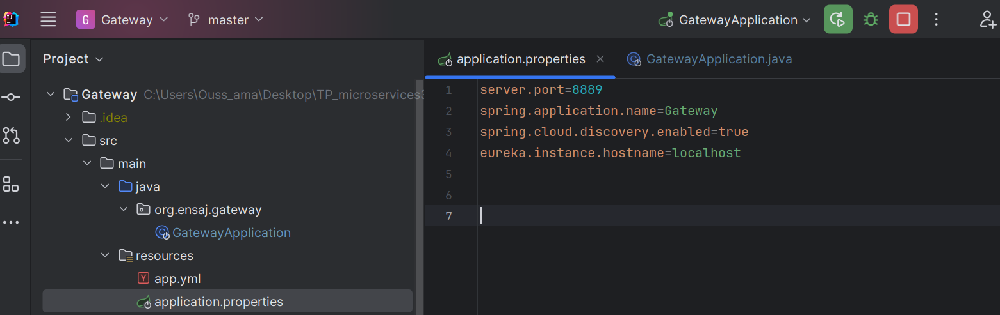
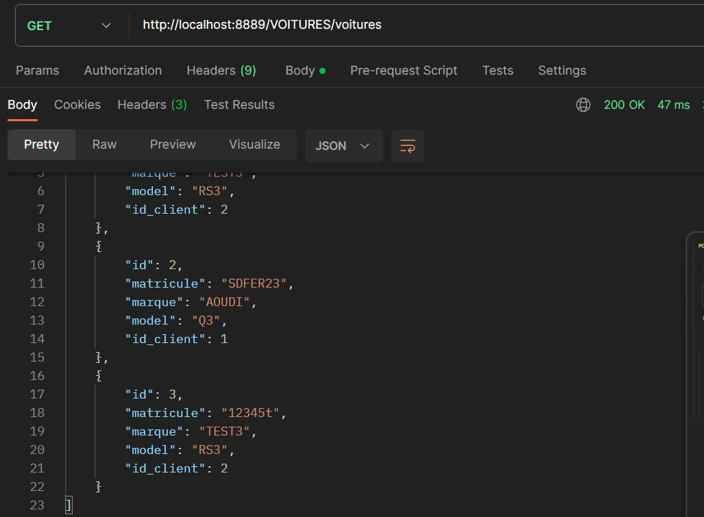

# Projet de Microservices avec Service Voiture, Service Client, Passerelle (Gateway) et Serveur Eureka
# OUHAYOU OUSSAMA
## Introduction

Ce projet est une architecture de microservices conçue pour gérer les fonctionnalités liées aux voitures et aux clients, en utilisant une passerelle pour la gestion des requêtes entrantes et un serveur Eureka pour la découverte des services.

## Services
Dans ce TP, nous adopterons une architecture basée sur les microservices, caractérisée par la décomposition d'une application en de petits services indépendants. Au cœur de cette structure se situent les microservices clients, des entités autonomes qui interagissent pour fournir une fonctionnalité complète. L'API Gateway agit en tant que point d'entrée centralisé, simplifiant la gestion des requêtes en dirigeant le trafic vers les microservices appropriés. Le serveur de découverte Eureka revêt un rôle crucial en permettant à chaque microservice de s'enregistrer de manière dynamique, formant ainsi un annuaire décentralisé des services disponibles.

### a-Service discovery Eureka
Le service discovery Eureka fournit un mécanisme permettant à chaque microservice de s'enregistrer auprès d'un annuaire, permettant ainsi une découverte dynamique des services disponibles dans l'écosystème.

### b-Gateway
La Gateway représente le point d'entrée principal pour toutes les requêtes externes. Elle dirige intelligemment le trafic vers les microservices appropriés en fonction des demandes reçues.

### c-Service Client
Le service Client gère toutes les interactions et informations relatives aux utilisateurs ou clients de l'application.

### d-Service Voiture
Le service Voiture gère les détails, les fonctionnalités et les actions liées aux véhicules dans le système.

## Test

Tester le service client d'apres gatwaye et recuperer des clients

Tester le service voiture d'apres gatwaye, recuperer et ajouter des voitures

Inserer dune nouvelle voiture

Verifier l'ajoute

Verifier dans la base de donnees

OUHAYOU OUSSAMA
